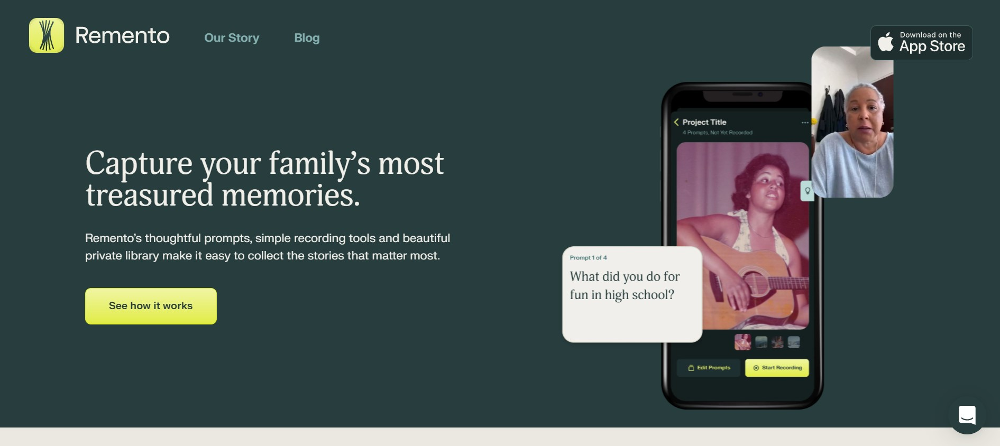
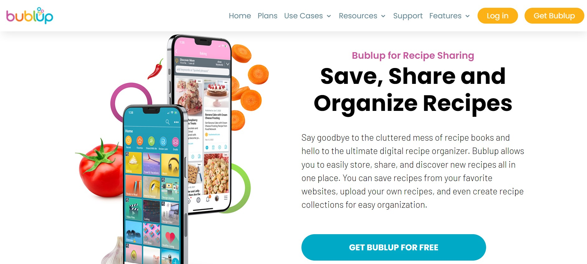

# Assignment 01: Heuristic Evaluation - Samantha Alexis Manuel, DH110

## Tentative Title: With Ingredients that Bind (Family) 

My project focuses on preserving family traditions through recipe and  food connections. 
For many Filipinos like me, my most cherished inheritance or heirlooms are the recipes that are passed down orally in the kitchen. Whenever I cook my Filipino food, it transforms into a moment of cultural-culinary, intergenerational connection– ever-changing rituals revised by each new generation. It helps me maintain a rootedness in my own cultural ancestry while living here in America, so I was curious to see if any apps existed to help preserve or share family recipes.  In this assignment, I conducted a heuristic evaluation of two apps peripheral to the goals of this project.

## Competitor A: Remento 

View the full site here: [Remento](https://www.remento.co/)

#### Background Information
Remento is an app that allows you to preserve your family’s treasured memories. With their conversation prompts and simple recording tools, you can consolidate your family history into a private digital library. 

#### Heuristic Evaluation 
_Overall Evaluation_: Overall, this app is very aesthetically pleasing to look at, intuitive to use, and its prompts help to guide meaningful conversations. More importantly, it captures sentimental features of a story– emotion, facial expression, and voice. I make minor recommendations to increase user efficiency and engagement, but it is, overall, a very thoughtful app with the option of creating your own prompts. Contentwise, very compelling and beautiful to look at. 

| Heuristic & Description                                                                                                                                                                                       | Evaluation                                                                                                                                                                                                                                                                                                                                                                                                                                    | Recommendation for "Bad" Element(s)                                                                                                                                                                                                  | Severity of "Bad" Element(s) |
| ------------------------------------------------------------------------------------------------------------------------------------------------------------------------------------------------------------- | --------------------------------------------------------------------------------------------------------------------------------------------------------------------------------------------------------------------------------------------------------------------------------------------------------------------------------------------------------------------------------------------------------------------------------------------- | ------------------------------------------------------------------------------------------------------------------------------------------------------------------------------------------------------------------------------------ | ---------------------------- |
| #1: Visibility of system status  Overall, the ability to see when a project was last updated or how many prompts allows the user to know that the media has been properly uploaded.                     | Good: Indicates when a project was last updated/recorded as well as how many prompts were answered.  Bad: Does not indicate how much space within app is used up per project                                                                                                                                                                                                                                                            | Perhaps a bar indicator to show how much left space is left in the app to use for individual projects.                                                                                                                               | 2                            |
| #2: Match between system and the real world  Overall, the design is perfectly clear and easy to follow except for where the navigation menu is placed.                                                  | Good: A “+” button to indicate where to “Send a request” (pick a prompt for someone to record remotely) or “Record In-Person” (prepare a set of prompts to record in-person).  Good: A hamburger menu (navigation bar) that lists 4 menu items (Projects, Account Information, Help & Information, and Contact) is generally well-recognizable.  Bad: Navigation menu is at the bottom of the screen                              | Recommending the use of a floating/prominent hamburger menu, slide out navigation tabs, or a tabbed menu (which is adopted by Instagram and Facebook). You would be able to see more core features/functionality of the home page.   | 1                            |
| #3: User control and freedom  Overall, the inability to undo actions is a major flag within the app, it would be hard to recover materials recorded directly from the app.                              | Good: Option to “Delete Project” written in red beside a trash icon  Good: Ability to cancel downloads (if accidental or unwanted)  Bad: Button to “Delete Project” is not clearly outlined (you must press on another toggle menu to do this)  Bad: Inability to “Undo” actions                                                                                                                                            | The addition of a “Delete Project” button clearly labeled and discoverable as well as an option to undo actions (not just canceling downloads).                                                                                      | 3                            |
| #4: Consistency and standards  The application relies on well-established conventions.                                                                                                                  | Good: Use of menu icons such as hamburger menus (3 horizontal lines) and kebab menus (3 vertical dots)  Good: Use of “+” sign for adding new assets to the digital platform.                                                                                                                                                                                                                                                            |                                                                                                                                                                                                                                      | 0                            |
| #5: Error prevention  The pop-ups are helpful and easy to exit. On the other hand, it’s uninspiring to see only one example project (sets a limited perspective of the app).                            | Good: Pop-ups are used to communicate errors gracefully.  Bad: No offer for suggestions of prompts or types of projects to create on the homepage                                                                                                                                                                                                                                                                                       | Addition of default projects or specific groups of prompts (e.g. Prompts for Mom, Dad, or Grandparents). Especially for users who just started using the application and don’t know where to begin.                                  | 3                            |
| #6: Recognition rather than recall  The app needs to provide access to edits recently made to help users resume tasks they may have forgotten or left on.                                               | Bad: Lack of a tab which indicates history of work made on individual projects.                                                                                                                                                                                                                                                                                                                                                               | Another addition to the main navigation menu for a page dedicated to history of work. This would be helpful for recalling what new changes were made to a project.                                                                   | 3                            |
| #7: Flexibility and efficiency of use  For those wanting to simply see the homepage and app for itself or as a whole forcing users to go through a tutorial is inefficient (and somewhat of a barrier). | Bad: Forced to go through a tutorial (where you must upload a picture or record voice/video)  Good: Tutorial leaves you with your first project made (but actually doesn’t cover the navigation of the app itself)                                                                                                                                                                                                                      | Simply omitting the tutorial or making it optional by creating a button that says “Skip tutorial” would allow for more efficiency and still cater to both inexperienced and experienced users.                                       | 3                            |
| #8: Aesthetic and minimalist design  Interface is beautiful and overall easy to read.                                                                                                                   | Good: Dark Green is easy on the eyes and the color palette is complimentary.  Good: Good use or icons to indicate deletion (with a trash icon) or help center (with a question icon). Bad: Text is very small and not adjustable from the app itself.                                                                                                                                                                                | Would be helpful to consider an option to adjust the size or color of text on the app for those visually impaired. This could be made in addition to a menu item for customizable settings.                                          | 2                            |
| #9: Help users recognize, diagnose, and recover from errors  It seems that if users encounter issues, they must search/diagnose it themselves, which can be difficult to mitigate.                      | Good: Good use of traditional/conventional error message design (if something was not downloaded correctly, its indicated so in bold, red text).  Bad: Lack of immediate solution, you must exit to the navigation menu and choose either “Help & Info” or “Contact Remento” to solve the error.                                                                                                                                        | Use of pop-ups to indicate what to do when faced with an error. Rather than opening the “Help Center” from the site’s web page, it should open in the app as well, hovering above the indicated error with a solution in the bubble. | 3                            |
| #10: Help and documentation  The “Help & Info” tab is clear and easy to find. Overall, intuitively designed.                                                                                            | Good: “Steps to Get Started” list found as the first item on the top of the “Help & Info” page clearly outlines 3 simple steps (with universal icons) on how to use the app.  Good: Use of “Contact Remento”, made to look like a messaging app. Also indicates when they are online to answer inquiries.  Bad: Documentation is not presented in context, rather, when you open the help center, you are redirected to the site. | Perhaps an added option to “Troubleshoot” the app or the opportunity to present the “Help & Info” at the top of every subproject folder.                                                                                             | 2                            |

## Competitor  B: Bublup

View the full site here: [Bublup](https://www.bublup.com/recipe-sharing-app/ )

#### Background Information
Bublup is an app that allows you to access and share your files, but in this context, your favorite recipes from anywhere in the world. You may simply upload and digitally organize recipes with your smartphone, desktop, or tablet and you access them at any time. 

#### Heuristic Evaluation 
_Overall Evaluation_: Overall, Bublup, as a project management app, is helpful in that it works by saving and storing all your digital documents, specifically recipes. One of the features that Bublup offers is a way to organize and share recipes in one central location as well as archive recipes found online. Furthermore, you are able to create your own digital cookbook with a Bublup roll (aka a customized webpage). Despite being text heavy and not the most visually appealing app,  it presents many capabilities and includes more personalization options (in terms of personal preference for app display) than the previous app. 

| Heuristic & Description                                                                                                                                                                                          | Evaluation                                                                                                                                                                                                                                                                                                                                                                                                          | Recommendation for "Bad" Element(s)                                                                                                                                                                                             | Severity of "Bad" Element(s) |
| ---------------------------------------------------------------------------------------------------------------------------------------------------------------------------------------------------------------- | ------------------------------------------------------------------------------------------------------------------------------------------------------------------------------------------------------------------------------------------------------------------------------------------------------------------------------------------------------------------------------------------------------------------- | ------------------------------------------------------------------------------------------------------------------------------------------------------------------------------------------------------------------------------- | ---------------------------- |
| #1: Visibility of system status  Clear and Intuitive use of the “My Plan & Storage” page. Very helpful for knowing how much information is being stored on the app.                                        | Good: Separate Tab made for “My Plan & Storage” along with a bar which visually indicates the amount of storage used. This also includes monitoring storage for the daily/monthly video streaming & downloads.  Good: Ability to email diagnostics.                                                                                                                                                           | N/A                                                                                                                                                                                                                             | 0                            |
| #2: Match between system and the real world  Overall, all terms, icons, concepts, and images used in the app are clear.                                                                                    | Good: Option for “Folder comments” made to look like a messaging app is familiar, making the option to share comments enjoyable and intuitive.  Bad: Search icon and kebab menu right next to each other which can be accidentally pressed while intending to press another button.  Bad: Use of the kebab and hamburger menu on the same side of the screen (what is the difference between the two?). | Adding the Search icon at the bottom of the tabbed menu page. In addition to this, consolidating the 2 navigation menus into one underneath the tabbed menu to prevent confusion.                                               | 3                            |
| #3: User control and freedom  Offers clear ways to exit current interactions but not for canceling downloads                                                                                               | Good: Option to exit tutorial pop-ups if needed, clearly labeled with an “x”  Bad: Does not support ability to cancel downloads                                                                                                                                                                                                                                                                               | Adding a button or option to cancel downloads to prevent waste of storage.                                                                                                                                                      | 1                            |
| #4: Consistency and standards  Overall, pretty consistent with industry standards, I just have a few personal preferences.                                                                                 | Good: Great use of icons (such as the notification bell), account information (with a character icon/picture of you), or use of “+” for adding folders, links, notes, or documents.  Bad: Most icons are consistent with how its used traditionally except for the following: “Review Later” or “My Feed”                                                                                                     | If time permits, it would be nice to see a different use of icons for these menu options. The icon used for “My Feed” can be easily confused with the icon for “Wifi.”                                                          | 1                            |
| #5: Error prevention  App does not seem personalized to recipes, but rather relies on the user to do it themselves (which could discourage them from using the application).                               | Bad: Lack of suggestions/prompts for different types of ways to organize subfolders of recipes (can seem limiting to the user).                                                                                                                                                                                                                                                                                     | Adding prompts such as “Shared Family Recipes” for reminding the user the ability to collaborate/share folders (which is something that they don’t remind you of explicitly).                                                   | 2                            |
| #6: Recognition rather than recall  Issue with having 2 separate, but very similar categories on a menu but it can be very easily mitigated if consolidated.                                               | Good: Help is provided in context in the form of pop-ups. They ensure you’ve seen the pop-up when you press “Ok” which then closes the pop-up.  Bad: Confusion between “Recent” and “History.” These should be consolidated rather than two separate items (they are also located under different tabs which makes it annoying to toggle between).                                                            | Consolidating “Recent” and “History” into one section under “My Info.” It can be all under “History” with a subfolder for “recent” (similar to the way search engines present their history).                                   | 3                            |
| #7: Flexibility and efficiency of use  Overall, provides a stronger degree of personalization, except for the fact that the text on the screen is not completely adjustable.                               | Good: Option to check the box saying “Do Not Show this Pop-up again.”  Good: Provides personalization (dark vs. light mode, colors/images for folder, notifications, security, and many more)  Bad: Forced tutorial in the beginning, no option to avoid this.                                                                                                                                          | Prior to opening the app, should have a prompt or ask if you are a returning or a new user. From there should make the tutorial optional/not optional.                                                                          | 2                            |
| #8: Aesthetic and minimalist design  Very text heavy app, It's not as appealing for these reasons– giving the impression of being cluttered.                                                               | Good: Simple design with text clear and easy to read.  Bad: Incredibly wordy as well as very small text presented in the subfolders with no way of adjusting its size.                                                                                                                                                                                                                                        | Bigger text that is consistent across the platform (text font changes throughout which is disruptive) as well as an ability to control the size/organization of folders within.                                                 | 3                            |
| #9: Help users recognize, diagnose, and recover from errors  Overall, very good. Error messages are expressed in pop-ups in a way that is helpful and not annoying.                                        | Good: Error messages are expressed in pop-ups and in plain language that informs users.                                                                                                                                                                                                                                                                                                                             |                                                                                                                                                                                                                                 | 0                            |
| #10: Help and documentation  Overall, pretty intuitive and provides visual aids, such as videos, to help. Only issue if the “Support Center”, which is just another website page the app redirects you to. | Good: “Help Center” is very helpful and includes video tutorials as well as information on how to share Bublup from other apps.  Bad: “Support Center” is misleading/redundant. It seems like a way to chat with a representative or message for help, but it’s just a consolidated version of tutorials on one web page.                                                                                     | If the app wants to have a “Support Center” they could reframe this like a messenger app which is friendly and familiar. It can also be reassuring to the user inquiring since a messenger app represents/encourages immediacy. | 3                            |

